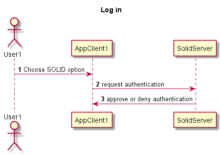
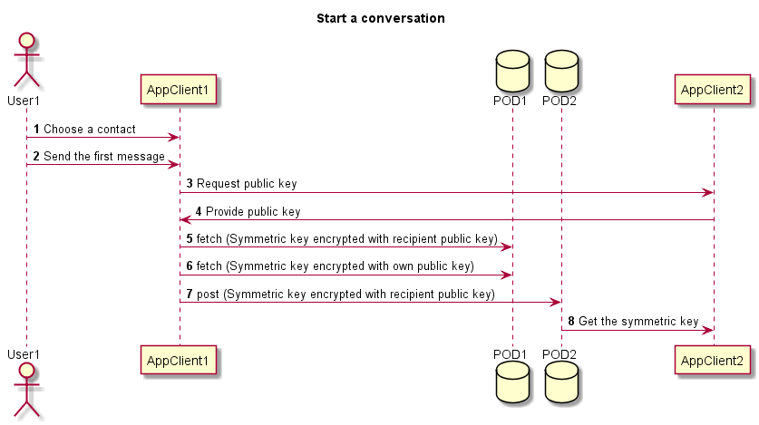

[[section-runtime-view]]
== Runtime View

=== Log in
1. The user should choose one of the options provided by SOLID. They are the following: using a local POD or use a POD stored in one of the SOLID servers.
2. Once the user has chosen an option, the SOLID server approve or deny the authentication.
3. Eventually, the user is able to use the chat.

=== Start a conversation
1. The first step is to choose a contact without a started conversation.
2. When it is sent the first message, at first the sender application create a symmetric key.
3. The application of the sender request the public key of the recipient.
4. The symmetric key is encrypted twice using asymmetric keys. It is meant using the public key requested before and the own public key.
5. The symmetric key encrypted with both public keys is stored in the POD of the sender. So finally, the symmetric key is being stored twice with two different public keys.
6. The uri of the key encrypted with the recipient public key is stored in the POD of the recipient who is going to decrypt it using his private key. The sender is going to decrypt the symmetric key using its own private key.
7. Then they are already able to send and receive messages securely.

=== Send and receive messages
1. The message is encrypted using the symmetric key shared in the first contact.
2. When the message is encrypted, it is stored in the POD of the user who sends the message.
3. The uri is stored in the POD of the recipient using the SOLID api.
4. The recipient is notified about the new message because of the changes produced in his POD.
5. When the recipient application try to access to the content, the message is decrypted using the symmetric key.
6. Finally, the content of the message appears in the recipient application.

image::../images/sendReceiveMessageRuntimeDiagram.png[Send and receive messages runtime diagram]

=== Add new contacts
1. The user has to introduce the url of the POD id of the person who wants to chat with.
2. Finally the contact is stored in the POD of the user who add the other one.

image::../images/addContactsRuntimeDiagram.png[Add new contacts]