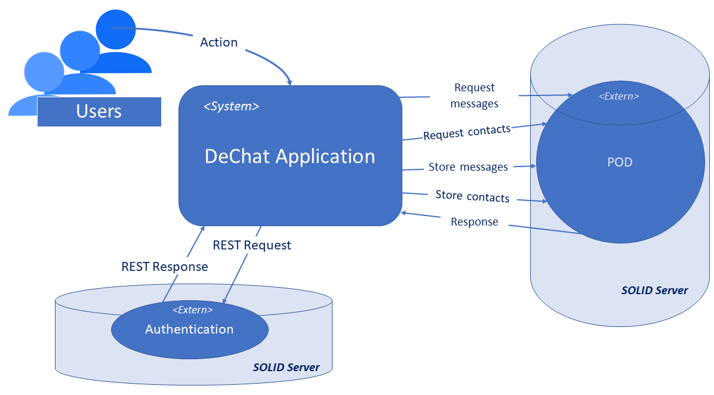

[[section-system-scope-and-context]]
== System Scope and Context

=== Business Context

image::../images/business-context.png[Business context representation]

=== Technical Context

The authentication is made using a request to a SOLID server. The rest of the information (contacts, messages...) are placed in the POD which is in possession of the user.
