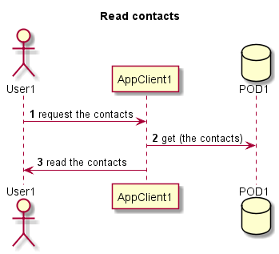
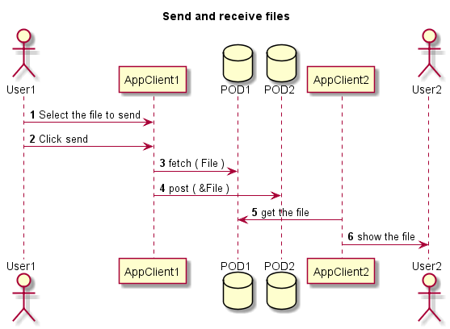
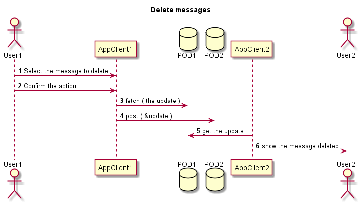
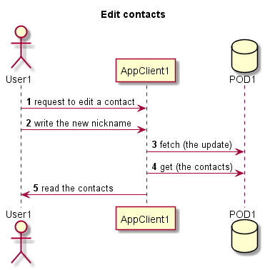
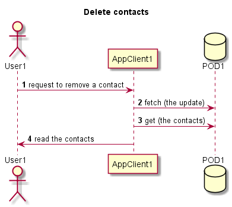

[[section-runtime-view]]
== Runtime View

=== Log in
1. The user should choose one of the options provided by SOLID. They are the different SOLID's servers available.
2. Once the user has chosen an option, the SOLID server approve or deny the authentication.
3. Eventually, the user is able to use the chat.

image::../images/logInRuntimeDiagram.png[Log in runtime diagram]

=== Read contacts
1. The user request to load the contacts stored.
2. The application access to the own POD and it loads the contacts.

=== Send and receive messages
1. The sender write a new message and click send.
2. The sender's application stored it in the POD of the user who sends the message.
3. The sender's application write a notification in the inbox of the receiver's POD.
4. The receiver's application realize that it has new messages.
5. The receiver is able to see the messages and answer to them if it's wanted.

image::../images/sendReceiveMessageRuntimeDiagram.png[Send and receive messages runtime diagram]

=== Send and receive files
1. The sender select a file to send.
2. The sender's application stored it in the POD of the user who sends the file.
3. The sender's application write a notification in the inbox of the receiver's POD.
4. The receiver's application realize that it has new messages.
5. The receiver is able to see the files and answer to them if it's wanted.

=== Delete messages
1. The user select an own message to be deleted.
2. The user confirm the action and then the user's application update the POD and notifies the receiver.
3. The receiver's application realize that it has been removed.
5. The receiver is able to see that the message was deleted.

=== Add new contacts
1. The user has to introduce the uri of the POD of the person who wants to chat with and a nickname if it's wanted to identify the contact. If it's not specified the identification of the contact will be the uri of the POD. Now it's not able to change the nickname, you need to remove and add the contact again.
2. Finally the contact is stored in the POD of the user who add the other one.

image::../images/addContactsRuntimeDiagram.png[Add new contacts]

=== Edit contacts
1. The user select the user which wants to edit the nickname to.
2. In the modal appeared window the user introduce the new nickname or alias and then it press the button to apply the changes.

=== Remove contacts
1. The user select the user which wants to delete.
2. The user press the button in the appeared modal window to apply the changes.

