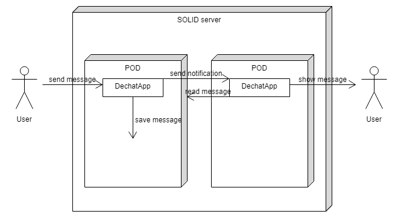

[[section-deployment-view]]

== Deployment View

=== Infrastructure Level 1

The infrastructure only has 2 hardware per user: the user's computer with which it access his POD and said POD that rests on SOLID's servers; SOLID's servers are a kind of server that store the PODs which can be configured by anyone, based on certain specifications, so everyone can decide where to store their POD.

While the development of the application is running the deployment is easy, it only needs to be served on the user's computer and to reach the user's POD. As long as SOLID's servers are online and the POD isn't broken then the application will start to work.

On the other side, while testing, the application will stay local.

==== Requirements and OS

It's mandatory, in order to run the application, that Node.js and angular/cli are installed on the computer, at least at this point in time. As for the OS, it's irrelevant, the application is made to work in every OS, that's to say, it's multiplataform.

=== Infrastructure Level 2

It must be said that even if PODs could be in the same server, they could also be in totally diferent SOLID servers. Even so, that doesn't change the way the application works since it doesn't affect the deployment or the conexion between PODs. The app gets deployed in a computer by using "ng serve" on the cmd while on the directory of the app, and form there the user logs in and connects to other PODs regardless of their location.
