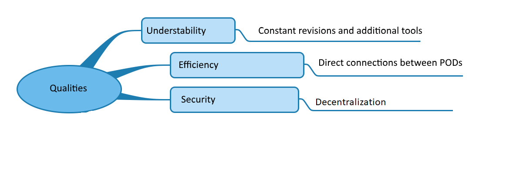

[[section-quality-scenarios]]
== Quality Scenarios

=== Quality Tree

=== Quality Scenarios

- As a message from a contact arrives:

 + The app should show it if the user is on the conversation.

 + The app should alert the user that a new message has arrived if they are not on the conversation.

- As you add a contact:

 + The app should open a conversation with said contact to begin to send messages.
 

TODO (These scenarios describe what should happen when a stimulus arrives at the system - Concretizaion of (sometimes vague or implicit) quality requirements using (quality) scenarios.)

