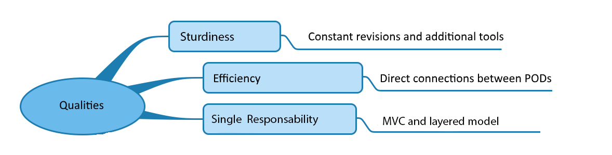

[[section-quality-scenarios]]
== Quality Scenarios

=== Quality Tree

=== Quality Scenarios
TODO (These scenarios describe what should happen when a stimulus arrives at the system - Concretizaion of (sometimes vague or implicit) quality requirements using (quality) scenarios.)

